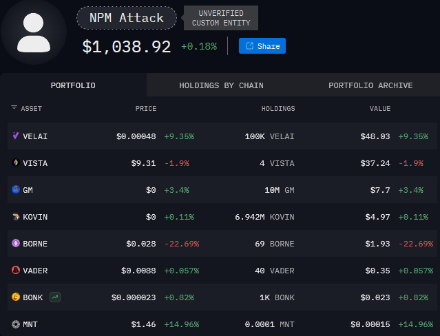

On September 8th of 2025 the Node Packet Manager suffered the largest supply chain attack in JavaScript's ecosystem history, compromising 18 packets with 2 billion weekly downloads, potentially affecting millions of services that use them as dependencies in their infrastructure.

The affected packages were the following:

Affected Packages and Weekly Downloads

| Package | Weekly Downloads |
|---------|------------------|
| ansi-styles | 371.41m |
| debug | 357.6m |
| chalk | 299.99m |
| supports-color | 287.1m |
| strip-ansi | 261.17m |
| ansi-regex | 243.64m |
| wrap-ansi | 197.99m |
| color-convert | 193.5m |
| color-name | 191.71m |
| is-arrayish | 73.8m |
| slice-ansi | 59.8m |
| error-ex | 47.17m |
| color-string | 27.48m |
| simple-swizzle | 26.26m |
| has-ansi | 12.1m |
| supports-hyperlinks | 19.2m |
| chalk-template | 3.9m |
| backslash | 0.26m |

*Note: These figures represent approximate weekly downloads prior to the attack, totaling over 2.6 billion collectively.*

# Which was the root of the attack?

The attack was executed by targeting a known developer and npm mainteiner, [Josh Junon](https://bsky.app/profile/bad-at-computer.bsky.social) aka "[qix](https://www.npmjs.com/~qix)", through a fairly simple crafted phishing email. The attacker sent a 2FA reset email from the malicious address support[at]npmjs[.]help, which Josh textually stated, "looked very legitimate".

This is the exact phishing email that Josh received:

# The attacker's goal: to steal millions in cryptocurrency

The primary objective of the attackers was to siphon off cryptocurrency funds from users of decentralized applications and web3 wallets. By compromising high-profile npm packages, they injected sophisticated malware known as a "[crypto clipper](https://www.merklescience.com/blog/how-clipper-malware-poses-a-threat-to-crypto-transactions)" designed to intercept and alter cryptocurrency transactions in real-time. This malware targeted multiple blockchains, including Ethereum, Bitcoin, Solana, Tron, Litecoin, and Bitcoin Cash, by replacing legitimate recipient wallet addresses with those controlled by the attackers. The goal was to redirect potentially millions in crypto assets, exploiting the trust in these dependencies.

# How the malware functioned

The injected malicious code was obfuscated using fairly amateur techniques like string encoding, variable renaming, and dead code insertion to evade static analysis and detection tools. Once installed via the compromised packages, the malware operated in browser environments where web3 interactions occur:

- **Passive Monitoring Mode**: It hooked into core browser APIs such as `fetch()` and `XMLHttpRequest`, scanning outgoing network requests for cryptocurrency-related data. Upon detecting a wallet address in transaction payloads, it silently swapped it with a malicious one.

- **Active Intervention Mode**: When wallet extensions like MetaMask or Phantom were detected (via checks for `window.ethereum` or `window.solana`), the malware intercepted transactions at the signing stage. It manipulated the transaction data in memory before user approval, replacing addresses while using a Levenshtein distance algorithm to generate visually similar "lookalike" addresses—differing by just a few characters to bypass hasty visual checks.

<small>*Code snippet of the malicious code*</small>
This dual-mode approach ensured broad coverage, affecting both API calls and direct wallet interactions. The code was embedded in key files like `index.js` and build outputs (e.g., `dist/cjs/proto-tinker.cjs.entry.js`), ensuring it executed early in the dependency chain.
In some variants, a post-install script was observed attempting to download and execute additional payloads, such as a Windows-specific DLL containing a remote access trojan (RAT) named Scavenger, though this was less prevalent in the npm-focused attack.

# Who is the hacker behind the attack?

Details on the attacker remain limited, but investigations have revealed some indicators. 

Regarding crypto links, the malware hardcoded several drainer wallet addresses across the targeted blockchains. These have been publicly documented in a GitHub gist for community reference and blocking: [Malicious Addresses](https://gist.github.com/0x-ultra/22c5d4228ce813f04380dc686f35f26b). Blockchain analysis shows minimal success, with only around $1,000 in stolen funds as of today (mostly in low-value memecoins) before the malicious versions were rolled back—thanks to swift alerts from the open-source community and npm's response team. This suggests the attack may have been a probe or disrupted prematurely, preventing larger-scale theft.

A community researcher, [Rani Haddad](https://x.com/4484), grouped the known attacker's wallets under an identity named "NPM Attack", which can can be publicly viewed in real-time at their [Arkham Entity](https://intel.arkm.com/explorer/entity/290c0a74-7647-4ec1-8302-9b6846a8c2b1)
.

**No specific attribution to a threat group has been made public yet**, but the attack's sophistication in crypto manipulation points to actors with prior experience in blockchain-targeted malware. Ongoing monitoring of the linked wallets may yield further insights as transactions unfold.

# Aftermath and why the attack couldn't escalate

Fortunately, the attack's impact was contained rapidly: qix regained control within hours, npm deprecated the malicious versions, and package managers like Yarn and pnpm issued warnings. Developers are urged to pin versions, enable 2FA with hardware keys, and audit dependencies regularly.
Despite its potential to affect *billions* of package downloads, was contained before causing widespread damage, demonstrating the resilience of blockchain ecosystems and the broader open-source community:

- **Rapid Community Response**: The open-source community’s vigilance was key. Within hours, developers identified anomalies in package updates, shared alerts on social media platforms, and collaborated to flag malicious versions. This quick action, combined with npm’s swift deprecation of compromised packages, limited the malware’s reach.

- **Limited Malware Scope**: The [crypto clipper](https://www.merklescience.com/blog/how-clipper-malware-poses-a-threat-to-crypto-transactions) relied on endpoint manipulation, swapping wallet addresses in users’ browsers or wallets. It couldn’t alter the blockchain networks themselves, which are secured by decentralized consensus. This confined the attack to individual user devices, preventing systemic compromise and making it easier to detect and block malicious wallets via community efforts like the [GitHub gist](https://gist.github.com/0x-ultra/22c5d4228ce813f04380dc686f35f26b).

- **Transparent Tracking**: Blockchain’s public ledger enabled immediate tracking of the attacker’s hardcoded wallet addresses. Tools like Arkham Intelligence and blockchain explorers allowed researchers to monitor and publicize the “NPM Attack” entity’s activity in real-time, neutralizing the threat by enabling blacklisting and community awareness.

This incident highlighted that while supply chain attacks can infiltrate trusted ecosystems, the layered defenses of blockchain technology, user verification, transparent ledgers, and decentralized security; alongside rapid community action, prevent such attacks from escalating into catastrophic losses. To maintain security, developers must update affected dependencies immediately, reinforcing the minimal impact seen with only $1,000 in stolen funds.